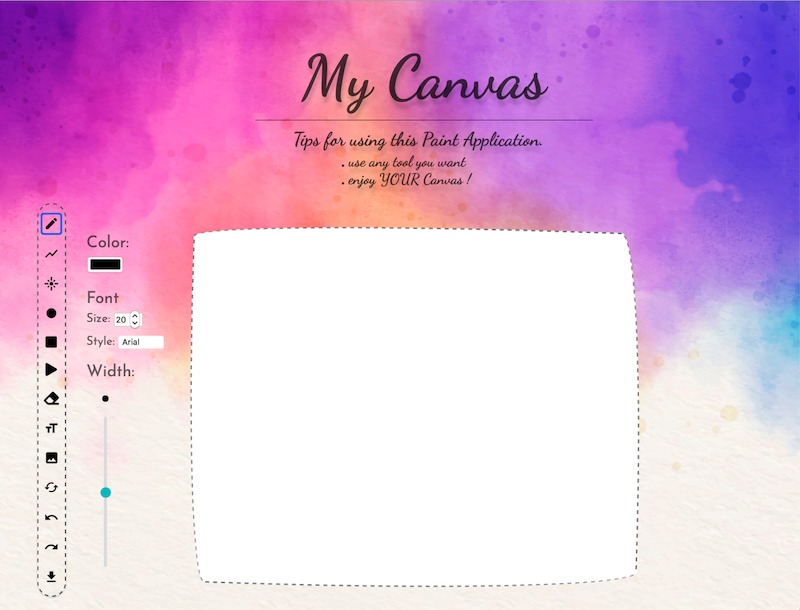

# Software Studio 2020 Spring
## Assignment 01 Web Canvas

### Scoring

| **Basic components**                             | **Score** | **Check** |
| :----------------------------------------------- | :-------: | :-------: |
| Basic control tools                              | 30%       | Y         |
| Text input                                       | 10%       | Y         |
| Cursor icon                                      | 10%       | Y         |
| Refresh button                                   | 10%       | Y         |

| **Advanced tools**                               | **Score** | **Check** |
| :----------------------------------------------- | :-------: | :-------: |
| Different brush shapes                           | 15%       | Y         |
| Un/Re-do button                                  | 10%       | Y         |
| Image tool                                       | 5%        | Y         |
| Download                                         | 5%        | Y         |

| **Other useful widgets**                         | **Score** | **Check** |
| :----------------------------------------------- | :-------: | :-------: |
| Name of widgets                                  | 1~5%     | N         |

---

### How to use 
#### Interface Overview

#### Tools Overview
- &nbsp;pencil
- &nbsp;line
- &nbsp;spray brush
- &nbsp;circle
- &nbsp;rectangle
- &nbsp;triangle
- &nbsp;eraser
- &nbsp;text
- &nbsp;load image
- &nbsp;claer all
- &nbsp;undo
- &nbsp;redo
- &nbsp;save

#### Basic Tools Effect
You can choice tools wanted in the tool bar on the left. The blue frame will show the active tool. And the cursor will switch to corresponded icon.

&nbsp;pencil:  
&emsp;&ensp; Default tool at the beginning, you can draw line on the canvas with it.

&nbsp;circle  
&emsp;&ensp; Draw circles with radius from the first click to mouseup.

&nbsp;rectangle  
&emsp;&ensp; Draw rectangles from the first click to mouseup.

&nbsp;triangle  
&emsp;&ensp; Draw triangles from the first click to mouseup with base on the x-axis movement and height on the y-axis movement.

&nbsp;eraser  
&emsp;&ensp; Clean any drawing on the canvas.
> &nbsp; width slider  
>
>  &emsp;&ensp; You can adjust the width of pencil and eraser on the right slider.

&nbsp;text  
&emsp;&ensp; Put text on the canvas. 
> &nbsp; font menu  
>
>  &emsp;&ensp; You can choose different text size and style on the right menu.

> 
> &nbsp;color selector  
>
>  &emsp;&ensp; All tools above can change to different color by the color selector on the right menu. You can choose any color then text or paint with it.
   
   
   

&nbsp; load image:  
&emsp;&ensp; Load images you choose onto the canvas, and the canvas will be changed to the size of loaded image. More, still can paint,text,erase on the image.

&nbsp;undo  / &nbsp;redo  
&emsp;&ensp; Reverse any mistake by "undo" or re-apply by "redo".

&nbsp;claer all  
&emsp;&ensp; Return to the beginning canvas. However, if you click it accidently, you can still go back to the last paint by "undo".

&nbsp;save  
&emsp;&ensp; You can save you gorgeous painting by clicking this button, then the canvas will be saved to ./download as "MyGorgeousCanvas.png".

### Function description

    Decribe your bouns function and how to use it.

### Gitlab page link

https://107062108.gitlab.io/AS_01_WebCanvas

### Others (Optional)

Enjoy the Canvas :)

